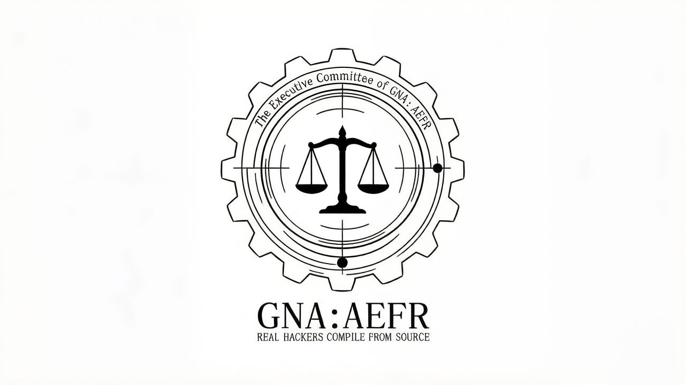

[简体中文](../README.md) | [English](./README_en.md) | [日本語](./README_jp.md)

<p align="center">
  
  <br>
  <b>진정한 해커는 소스로부터 컴파일한다. 진정한 자유는 AGPL 아래에서 숨 쉰다.</b>
</p>

# GNA's Not AA : AEFR's Eternal Freedom & Rust-rendered

> **집행위원회 공지**: 본 프로젝트는 GNU의 자유 정신에서 영감을 받았으며, 공식 GNU 프로젝트가 아님을 밝힙니다. 현재 "FSF (자유 소프트웨어 재단) 자유 소프트웨어 디렉토리" 등재 신청을 완료한 상태입니다.

## 우리의 Rust 순도는 GNU/Linux 커널보다 99.7% 더 높습니다!

**GNA:AEFR은 GNU 선언문의 정신을 고수하며, 키보토스의 창작 환경을 해방하기 위해 헌신하는 자유 소프트웨어 프로젝트입니다. 우리는 확신합니다. 소스 코드를 커뮤니티에 공개하지 않고 소프트웨어를 배포하는 행위는 사용자의 자유를 박탈하는 무책임한 처사입니다.**

---

### ⚖️ 라이선스
*   **v0.8.3 이전 버전**: **GPL-3.0** 라이선스 하에 배포되었습니다.
*   **v0.8.3 및 이후 버전**: "클라우드 기반 폐쇄형 소스 코드 루프홀"을 차단하기 위해, 본 프로젝트는 공식적으로 **AGPL-3.0** 라이선스로 이관되었으며 이를 의무화합니다.

---

## 🧭 네비게이션: GNA:AEFR의 철학

> **GNA:AEFR**은 대중의 비위를 맞추기 위해 설계된 평범한 애플리케이션이 아닙니다. 현재 코어 커널의 급격한 반복 개발 단계에 있으며, 순수 Rust 로직 위에 구축된 고성능 에디터 인스턴스입니다. **컴퓨팅의 세계에서, 가장 짧은 경로가 언제나 가장 무적입니다.**
> 
> 보편적인 호환성과 "즉시 사용 가능한" 낮은 진입 장벽을 원하신다면 **AA**를 사용하십시오. 만약 극한의 실행 효율, 절대적인 창작의 자유, 그리고 하드코어한 커뮤니티 주도 유지보수를 추구한다면 **GNA:AEFR**의 세계에 오신 것을 환영합니다.

*   **비공식 팬메이드**: 블루 아카이브 2차 창작을 위해 제작된 멀티 플랫폼, 멀티 스레드 에디터로, 순수 Rust로만 빌드되었습니다.
*   **엔진리스(Engine-less) 아키텍처**: Unity나 Unreal 같은 비대한 상업용 엔진 의존성을 거부합니다. 가벼운 `egui` 라이브러리를 통해 GPU 렌더링을 하드웨어 수준에서 직접 구동합니다.
*   **크로스 플랫폼 주권**: GNU/Linux, Android, macOS, Windows를 네이티브로 지원하여 서로 다른 운영체제에서도 일관되고 우수한 경험을 보장합니다.

### ✨ 구현된 기능 (핵심 기능)
- [x] **동적 장면 재구성**: 고해상도 장면 배경의 실시간 교체 지원.
- [x] **다차원 스켈레탈 렌더링**: 최대 5개의 Spine 스켈레톤 애니메이션 파일 동시 임포트 및 병렬 렌더링 지원.
- [x] **정통 비주얼 스탠다드**: 표준 키보토스 스타일 대화창 렌더링을 완벽하게 재현.
- [x] **실시간 모션 디스패칭**: 스켈레톤 애니메이션 상태(표정, 몸짓, 특수 효과)의 실시간 전환 지원.
- [x] **비동기 오디오 시스템**: 배경음악(BGM)의 비동기 로딩 및 끊김 없는 스트리밍 지원.

### 🎯 로드맵
- [ ] **비선형 편집 시스템**: 전문적인 타임라인 로직 도입.
- [ ] **매끄러운 트위닝(Tweening)**: 캐릭터 이동을 위한 선형 보간 및 부드러운 블렌딩 구현.
- [ ] **장면 일러스트 시스템**: 장면 내 레이어화된 일러스트 즉시 팝업 지원.
- [ ] **트랜지션 트랜스코더**: 페이드 및 와이프를 포함한 다양한 장면 전환 효과 개발.
- [ ] **상호작용 말풍선**: 캐릭터 머리 위 이모지 말풍선의 동적 추적.

**자유 소프트웨어의 이상에 동의하는 모든 해커들의 GNA:AEFR 개발 참여를 환영합니다.**

---

## 🚀 시작하기

> *"릴리스요? 진정한 해커는 소스로부터 컴파일합니다." ;-)*

[**Releases**](https://github.com/OxidizedSchale/GNA-AEFR/releases) 페이지에서 최신 소스 코드를 받거나, 특정 플랫폼용으로 미리 컴파일된 바이너리를 다운로드하세요.

**GNA:AEFR**은 **그래픽 사용자 인터페이스(GUI)**와 **명령어 기반(Command-Driven)** 로직이 깊게 통합된 상호작용 모델을 사용합니다.

*   **데스크톱**: 전체 그래픽 제어판 사용을 권장합니다.
*   **모바일**: 외부 리소스 임포트를 위해 현재 콘솔 명령어를 통한 정밀한 스케줄링이 필요합니다.

인터페이스 왼쪽 상단의 `[SHELL]` 버튼을 클릭하여 내장된 하드코어 디버깅 콘솔을 호출하세요.

<details>
<summary><strong>📖 클릭하여 펼치기: GNA:AEFR 명령어 참조 매뉴얼</strong></summary>

### 1. 비주얼 및 장면

*   **배경 로드**
    *   **명령어**: `BG <image_path>`
    *   **설명**: 배경을 즉시 전환합니다. `.jpg`, `.png`, `.webp` 형식을 지원합니다.
    *   **예시**: `BG C:\Assets\BlueArchive\BG_Classroom.png`

*   **캐릭터 로드**
    *   **명령어**: `LOAD <slot_ID> <.atlas_path>`
    *   **설명**: 스켈레톤 리소스를 슬롯 `0`번부터 `4`번까지 로드합니다. 성공 시 SHELL에 해당 캐릭터의 사용 가능한 모든 애니메이션 목록이 출력됩니다.
    *   **예시**: `LOAD 0 D:\Assets\Shiroko\Shiroko_Home.atlas`

### 2. 모션 및 퍼포먼스

*   **애니메이션 전환**
    *   **명령어**: `ANIM <slot_ID> <animation_name> [loop: true/false]`
    *   **설명**: 지정된 슬롯 캐릭터의 애니메이션을 전환합니다. `true`는 강제 반복, `false`는 단일 재생입니다. 애니메이션 이름은 로드 시 반환된 목록과 정확히 일치해야 합니다.
    *   **예시**:
        ```bash
        ANIM 0 Start_Idle_01 true    # 시로코가 대기 동작을 반복함
        ANIM 1 Attack_Normal false   # 1번 슬롯 캐릭터가 공격 동작을 한 번 수행함
        ```

### 3. 스토리텔링 및 대화

*   **대사 전송**
    *   **명령어**: `TALK <이름>|<소속>|<내용>`
    *   **설명**: 타자기 효과가 통합된 표준 대화창을 렌더링합니다. **매개변수는 반드시 파이프 문자 `|`로 구분해야 합니다.**
    *   **예시**:
        ```bash
        TALK 시로코|아비도스|선생님, 은행 털러 안 갈래?
        TALK 아로나|샬레|선생님, 업무 시간에 딴짓하시면 안 돼요!
        ```

### 4. 오디오 시스템

*   **BGM 재생**
    *   **명령어**: `BGM <audio_path>`
    *   **설명**: 오디오 엔진을 호출하여 오디오 파일을 비동기적으로 로드하고 루프 재생합니다.
    *   **예시**: `BGM D:\Music\Unwelcome_School.mp3`

*   **음악 정지**
    *   **명령어**: `STOP`
    *   **설명**: 현재 활성화된 오디오 출력 스트림을 강제 종료합니다.

</details>

---

### 💡 프로 팁

*   **경로 전처리**: Windows 사용자는 파일 경로를 직접 붙여넣을 수 있습니다. GNA가 따옴표와 이스케이프 문자를 자동으로 처리합니다. Android/Termux 사용자는 반드시 `/sdcard/`로 시작하는 절대 경로를 사용해야 합니다.
*   **스케줄러 보장**: 독특한 "젠틀맨 스케줄러(Gentleman's Scheduler)" 덕분에 UI 스레드가 물리적으로 격리되어 있습니다. 화면에 5명의 캐릭터가 풀 로드로 렌더링되는 중에도 인터페이스는 버터처럼 매끄럽게 유지됩니다.
*   **실시간 모니터링**: 리소스 로딩 상태와 애니메이션 파싱 로그를 실시간으로 확인하기 위해 SHELL 창을 띄워두는 것을 권장합니다.

---

## 🤝 기여 가이드

<details>
<summary><strong>클릭하여 펼치기: GNA 집행위원회 기여자 서약</strong></summary>

### 기술 스택의 순수성
본 프로젝트는 아키텍처의 순수성을 해치는 모든 행위를 엄격히 금지합니다. 핵심 비즈니스 로직은 반드시 100% **Rust**로 구현되어야 합니다.

*   **원칙적 거부**: C++ 런타임이나 무거운 프레임워크(예: Qt, Unity)와의 복잡한 JNI/FFI 상호작용을 도입하려는 제안.
*   **예외적 허용**: 저수준 시스템 C 라이브러리(그래픽 API, 오디오 백엔드)에 대한 Rust 세이프티 래퍼(Wrapper)만 허용됩니다. 이 경우:
    *   성숙한 커뮤니티의 `-sys` 바인딩을 최우선으로 사용할 것.
    *   `unsafe` 블록을 작성해야 한다면, 아래의 안전 증명 표준을 엄격히 따라야 함.
    *   궁극적인 목표는 비안전(Non-safe) 호출을 완전히 분리하고 투명하고 안전한 Rust API를 제공하는 것임.

### Unsafe 가이드라인: 성능이라는 양날의 검에 대한 제약
> `unsafe`는 Rust가 개발자에게 부여한 성능이라는 이름의 칼날입니다. 우리의 원칙은 "필요하지 않다면 사용하지 말고, 사용한다면 완벽을 기하라"입니다.

**핵심 원칙: 필요성의 증명**
`unsafe` 블록을 포함하는 모든 PR은 코드 주석에 필요성 증명을 제공해야 합니다:
1.  **사유**: 왜 안전한 Rust(Safe Rust)로는 현재의 저수준 요구사항을 충족할 수 없는지 명시할 것.
2.  **불가대체성**: 기존의 안전한 라이브러리들이 동일한 기능을 수행할 수 없음을 증명할 것.
3.  **안전 경계**: 개발자가 컴파일러에게 약속하는 메모리 불변성(Invariants)을 명확히 정의할 것.

</details>

---

## 🏛️ 아키텍처 철학

<details>
<summary><strong>클릭하여 펼치기: GNA:AEFR을 구동하는 하드코어 설계 심층 탐구</strong></summary>

### 젠틀맨 스케줄러: 컴퓨팅 수준에서의 계급 분리
> v0.8 이후부터 우리는 운영체제의 기본 스케줄링 로직을 신뢰하지 않습니다. 이는 종종 평범한 "공정함"을 위해 실시간 렌더링의 결정론(Determinism)을 희생하기 때문입니다.

*   **N-2 전략**: GNA는 물리 코어 개수 `N`을 강제로 감지하고 `N-2`개의 코어를 전용 컴퓨팅 구역으로 격리합니다.
    *   **렌더 코어**: 메인 스레드 GUI 드로잉을 위해 1개의 코어를 독점 잠금합니다.
    *   **오디오 코어**: CPU 스파이크로 인한 오디오 끊김을 완전히 제거하기 위해 시스템 오디오 "버퍼 공간"으로 1개의 코어를 잠금합니다.
    *   **연산 구역**: 남은 모든 코어는 Worker들에게 할당되어 Rayon 스레드 풀을 통해 Spine 스켈레탈 스키닝 연산의 물리적 성능을 마지막 한 방울까지 쥐어짜냅니다.

*   **동기적 블로킹 모델**: 웹 개발에서 흔히 볼 수 있는 값싸고 통제 불가능한 "비동기"를 거부합니다.
    *   **공간적 정렬**: 메인 스레드는 Update 단계에서 결과를 동기적으로 대기하여, 모든 프레임의 시각적 요소들이 시공간 속에서 절대적으로 정렬되도록 보장합니다.
    *   **워크 스틸링(Work Stealing)**: 저사양 코어 장치에서는 메인 스레드가 적극적으로 연산 작업을 이어받아 전력 활용률이 물리적 한계에 도달하게 합니다.

### GUI 설계 원칙
*   모든 컴포넌트는 `egui`의 **이미디엇 모드(Immediate Mode)** 철학을 엄격히 따라야 합니다.

</details>

---

## ✉️ 문의하기
*   **GNA 제작자 이메일**: `ExtraShiningWonder@gmail.com`

---
**"진정한 해커는 코드 속에서 질서를 찾고, 진정한 자유는 컴파일 후에 탄생한다."**
—— **GNA:AEFR 집행위원회**
